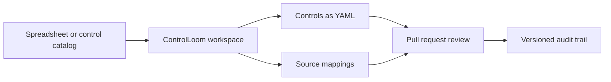

# ControlLoom

> Map compliance controls to implementation evidence in a Git-native workspace.

[](https://github.com/murillo-consulting/ControlLoom/actions/workflows/ci.yml)
[](LICENSE)

ControlLoom gives security, engineering, and audit teams one versioned place to import controls, maintain implementation narratives, and connect requirements to source files. It runs locally, stores its model as readable YAML, and uses normal pull requests as the review trail.



## Quickstart

Run the web interface and API from a local checkout:

```bash
git clone https://github.com/murillo-consulting/ControlLoom.git && cd ControlLoom
pnpm install
pnpm run dev:full
```

The interface opens on `http://localhost:5173`; the local API listens on `http://localhost:3000`.

## What it does

ControlLoom focuses on five practical compliance workflows:

- Import spreadsheet-based control catalogs without requiring OSCAL expertise.
- Store each control as reviewable YAML instead of an opaque database record.
- Map controls to exact source files and documentation entries.
- Track edits through Git history and pull requests.
- Detect whether a code change touches mapped compliance evidence.

## Control workspace

A workspace keeps its metadata, controls, and mappings together:

```text
compliance/
├── controlloom.yaml
├── controls/
│   ├── AC/
│   └── AU/
└── mappings/
    ├── AC/
    └── AU/
```

The interface creates and updates these files. Because the storage format is plain YAML, reviewers can inspect changes without running ControlLoom.

## Pull request impact analysis

The `crawl` command checks a pull request for changes that intersect with mapped evidence:

```bash
OWNER=example REPO=service PULL_NUMBER=42 GITHUB_TOKEN="$(gh auth token)" \
  pnpm exec controlloom crawl --post-mode=console
```

Use `--post-mode=comment` only when the supplied GitHub token may write pull request comments.

## Architecture

ControlLoom combines a SvelteKit interface with a local Express API:

- `src/`: SvelteKit interface and browser-side state.
- `cli/`: commands, API routes, Git history, and file persistence.
- `integration/`: pull request analysis fixtures and integration coverage.
- `samples/`: example import files with non-sensitive data.
- `static/`: independent ControlLoom visual assets.

Git owns the durable audit trail. The application does not require a hosted database or an external language-model API.

## Development

ControlLoom requires Node.js 22.20 or later and pnpm 11.

Run the same checks used by continuous integration:

```bash
pnpm run format:check
pnpm run lint
pnpm run check
pnpm run test
pnpm run build
```

Integration tests that interact with GitHub require an explicit test repository and token. The default CI workflow does not receive deployment or publication credentials.

## Security

Do not import production evidence, credentials, private audit reports, or personal data into a public control workspace. Use [GitHub private security advisories](https://github.com/murillo-consulting/ControlLoom/security/advisories/new) to report vulnerabilities without opening a public issue.

## Provenance

ControlLoom is maintained by [Adrien Murillo](https://github.com/murillo-consulting). It preserves the Apache-2.0 attribution of the original Lula source. The Defense Unicorns commercial-only styles and branded image are intentionally excluded and replaced with independently written assets. Detailed provenance is recorded in [NOTICE](NOTICE).

## License

ControlLoom is distributed under the [Apache License 2.0](LICENSE). Original and third-party components remain under their respective terms.
